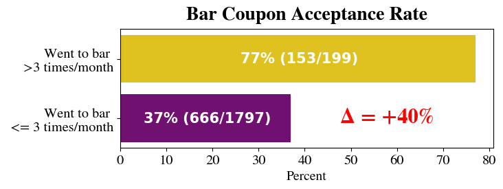
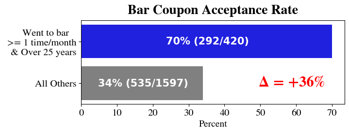
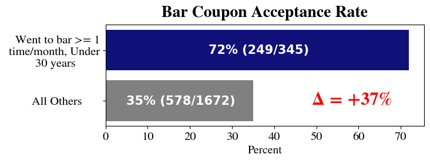
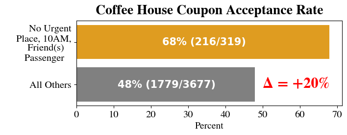
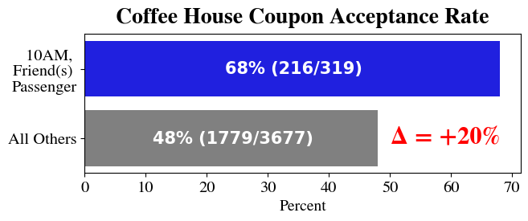

# Practical-Application-1: UC Berkeley Haas ML/AI Program  - Will the Customer Accept the Coupon?
Jupyter Notebook Link: [https://drive.google.com/file/d/1iwX8FqmUYq5mA1SZ5XPCT47za2HhRUqZ/view?usp=sharing](https://drive.google.com/file/d/1iwX8FqmUYq5mA1SZ5XPCT47za2HhRUqZ/view?usp=sharing)

## Bar Coupon Findings

### Finding 1 
Going to the bar frequently each month (e.g. >3 time/month) increases bar coupon acceptance rate.

  

### Finding 2
Among those that go to the bar at least 1 time per month, being either under 25 or over 20 years results in around a 70% bar coupon acceptance rate. 

  

  

### Finding 3: 
Also, along with going to bar at least 1 time per month,  having kid passengers, and not being widowed are shown to have around a 70% acceptance rate of a bar coupon.

  

### Finding 4
Going to cheap restaurants frequently and and having a low income results in a slight increase in accepting a bar coupon.

  

## Coffee House Coupon Findings

### Finding 1 
No Urgent Place destination has around 20% higher acceptance rate than that of all others

  

### Finding 2
10 AM time has around 20% higher acceptance than that of all others

  

## Finding 3
Friend(s) passenger has around 15% higher acceptance than that of all others

  

## Finding 4
Expiration of 1 day has around 15% higher acceptance than that of all others

  

## Finding 5
Drivers that visit the coffee house >=1 time/month have 30% higher acceptance than that of all others. Those that visit 1-3 times/month have 20% higher acceptance rate.

  

## Finding 6
For students, their coupon acceptance rate is higher if  Coffee House Coupon Location is less than 25 min away or less than 15 min away.

  

## Actionable Items and Recommendations
Based on the conditions where the Coffee House coupon acceptance rate is higher, here are the following recommendations:

- It is advised to focus on focusing on drivers who visit a Coffee House at least once a month or identify regular customers.
- Since the acceptance rate is higher at 10 AM and when passengers are Friend(s), advertisements could be scheduled around that time on holidays and weekends, or times when it is likely to have friend passengers.
- Coffee House advertisements should have an expiration of 1 day or 2 hours.
- To target more students, coupons should be given for coffee shops near by less than 15 min. or 25 min.

